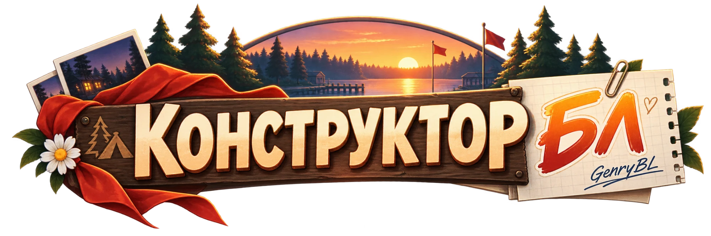
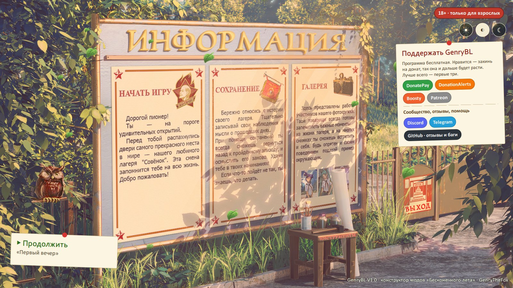
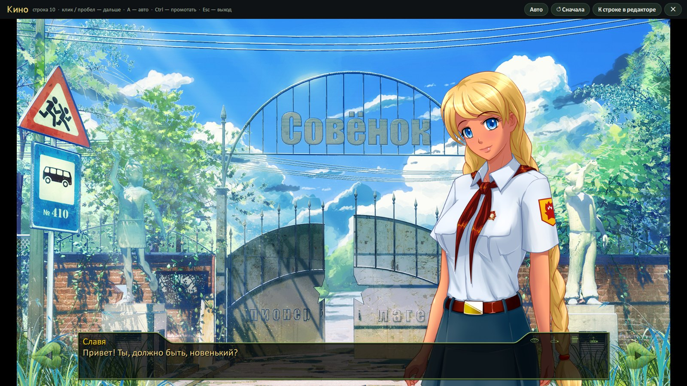
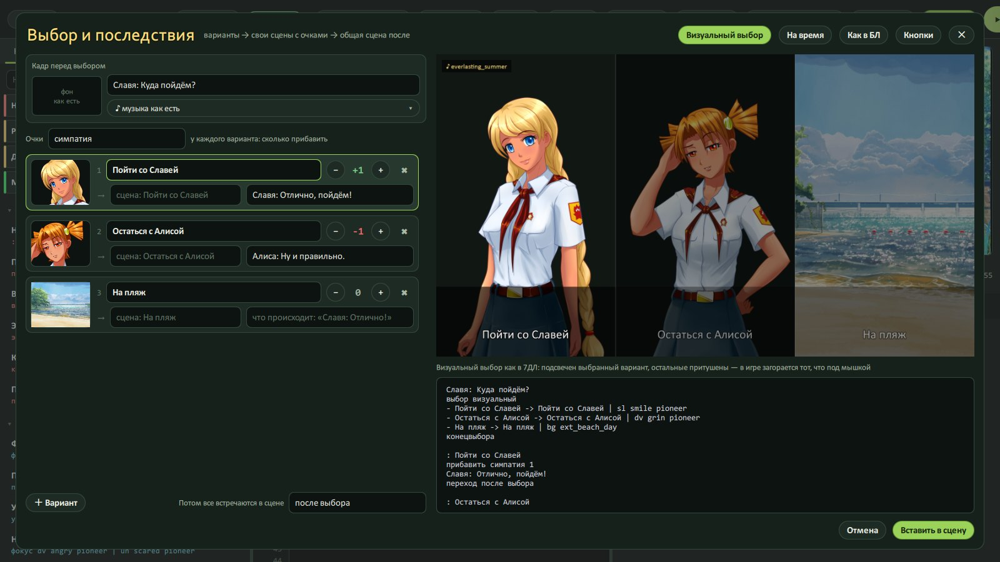
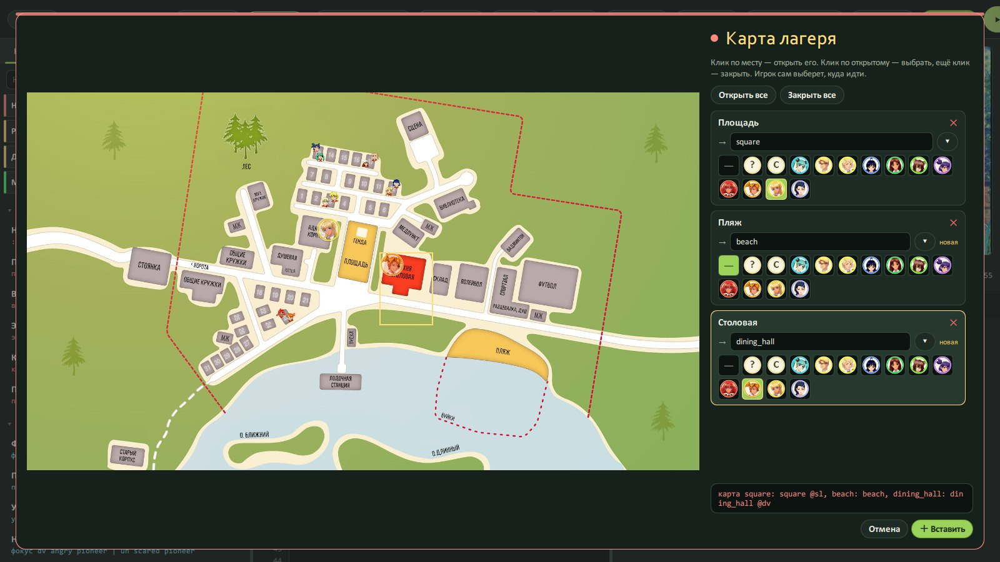

<p align="center">
  
</p>

<h1 align="center">GenryBL — Конструктор БЛ · V1.0</h1>
<p align="center"><strong>Твой лагерь. Твои истории.</strong><br>Your camp. Your stories.</p>
<p align="center"><strong>От создателя Project 2099 и Project Iron 6 · From the creator of Project 2099 and Project Iron 6</strong></p>

<p align="center">
  <a href="https://github.com/GenryTheFox0/GenryBL/releases/latest/download/GenryBL_Setup.exe"><b>Скачать</b></a> ·
  <a href="https://steamcommunity.com/sharedfiles/filedetails/?id=3809725763"><b>Мастерская Steam</b></a> ·
  <a href="#russian">Русский</a> ·
  <a href="#english">English</a> ·
  <a href="docs/README.md">Вики</a> ·
  <a href="https://t.me/teamgenrythefox">Telegram</a> ·
  <a href="https://discord.gg/2Yy45gJap3">Discord</a> ·
  <a href="https://www.youtube.com/@GenryTheFox1">YouTube</a>
</p>

<a id="russian"></a>

## Коротко по-русски

**GenryBL** — мой конструктор модов для **«Бесконечного лета»**. Меня зовут **GenryTheFox**, я автор
[Project 2099](https://github.com/GenryTheFox0/Project-2099) и [Project Iron 6](https://github.com/GenryTheFox0/Project-Iron-6).

После двух консольных портов я вернулся туда, где всё начиналось, — в «Совёнок». Мод для БЛ — это Ren'Py, отступы,
`show dv smile pioneer at left with dissolve`, ошибка на сорок строк и вожатая, которая смотрит с укором.
Я хотел, чтобы мод можно было просто **написать**. По-русски. Как текст. И сразу увидеть.

Три месяца разработки. **Охуеть, мы дошли до V1.0.**

```
фон ext_camp_entrance_day fade
показать sl smile pioneer right dissolve
Славя: Привет! Ты, должно быть, новенький?
```

Справа — тот же кадр, что нарисует сама игра, прямо из её архива. **«Играть» (F5)** — и GenryBL собирает мод,
кладёт его в игру и открывает БЛ **ровно на этой сцене**, со своими сохранениями. Без консоли, без ручной
возни с папками, без танцев с бубном.



## Что есть в V1.0

- **Живое превью.** Наводишь мышь на эмоцию — Алиса в кадре уже скривилась. На фон — вы уже на пляже. Время суток,
  погода, румянец — всё видно до запуска.
- **Кино-режим (F6).** Мод проигрывается прямо в конструкторе: текст печатается, музыка идёт, выборы работают.
- **48 команд по-русски** — от `фон` и `показать` до флешбэков, табло и звонков. Каждая — кнопкой с формой,
  помнить не надо.
- **Пиши как сценарий.** Кидаешь главу фанфика — «НАТ. ПЛЯЖ — ДЕНЬ» становится фоном, а
  `Алиса (злая, слева): Ну?` — спрайтом с репликой.
- **Выборы как у больших:** с картинками как в 7ДЛ, на время как в Telltale, «Алиса это запомнит», шкалы
  отношений, концовка по той, кого любят больше.
- **Телефон** с перепиской, фото, голосовыми и звонками «принял / сбросил / не взял», **карта лагеря**, **погода**,
  **флешбэки**, **3D-параллакс**, **румянец, пот и слёзы** на любом спрайте.
- **Гардероб Мастерской.** Подписался в Steam на моды с одеждой — GenryBL сам находит в них наряды и лица и
  надевает на героинь. У меня он собрал больше 9000 слоёв. Кривые отсеивает сам, остальные правишь ✎ или
  удаляешь ✕.
- **Звук и видео любого формата** — mp3, wav, mp4, что угодно: программа сама переделает под игру, ffmpeg внутри.
- **Ловит косяки до запуска** — опечатка в эмоции, несуществующий фон, потерянная сцена, выбор без конца.
- **Установщик в стиле самой игры** — блокнот, сова, прогресс-бар из настроек БЛ. Сам находит игру через Steam.
- **Своё главное меню мода**, главы, галерея, достижения, инвентарь, титры, заставки дней.

| Кино-режим | Выбор и последствия |
|---|---|
|  |  |
| **Пиши как сценарий** | **Карта лагеря** |
|  |  |

### Про 18+ — без пиздежа

GenryBL — **для взрослых**, и я этого не прячу.

- **Из коробки:** оригинал игры и её официальный 18+ патч
  [«Deleted hentai scenes»](https://steamcommunity.com/sharedfiles/filedetails/?id=1118110148)
  (автор — [Лена](https://steamcommunity.com/id/Lena_sova), низкий поклон). Он **встроен** — подписываться не надо.
- **CG из патча, которые ты вставишь в мод, GenryBL кладёт прямо в мод.** Игроки увидят их без всякого патча.
- **Всё остальное подхватывается из Мастерской само** — на что ты подписан в Steam: наряды, лица, тела, 18+ слои.
  Только для взрослых героинь.
- **Ульяны в 18+ нет и не будет.** В гардеробе она только в одежде и только на своём родном теле. Это не баг.

Нет 18 — закрывай вкладку и иди спать, пионер.

## Как установить

1. Скачай **[GenryBL_Setup.exe](https://github.com/GenryTheFox0/GenryBL/releases/latest/download/GenryBL_Setup.exe)**
   (или `GenryBL_V1_portable.zip`, если не любишь установщики) со [страницы выпуска](https://github.com/GenryTheFox0/GenryBL/releases/latest).
2. Запусти. Windows может испугаться неподписанной программы — «Подробнее» → «Выполнить в любом случае».
3. Подтверди 18+, выбери папку (админ не нужен). Игру установщик найдёт сам.
4. «Новый мод» — и понеслась. Всё по шагам — в **[вики](docs/README.md)**.

**Или прямо из игры:** подпишись на GenryBL в [Мастерской Steam](https://steamcommunity.com/sharedfiles/filedetails/?id=3809725763),
запусти БЛ → «Моды» → «GenryBL — конструктор модов» — лагерь покажет, что умеет конструктор, а в конце кнопка
«Установить GenryBL сейчас».

Нужны Windows 10/11 и «Бесконечное лето» из Steam (оно бесплатное). **Больше ничего качать не надо**: Qt,
Visual C++, ffmpeg и 18+ патч уже внутри — заводится даже на голой Windows.

## Как это делалось

**GenryBL сделан с помощью ИИ, и я этого не скрываю.** Три месяца разработки:

- **Codex** — от 5.4 до 5.6, Sol и Astra;
- **Claude** — от Opus 4.8 до Opus 5.5 (в титрах программы — Шрам).

Нейросети писали код, ловили баги, собирали инструменты и тесты. Я, GenryTheFox, придумывал, решал, гонял каждую
сборку на живом лагере и сотни раз говорил «не, переделывай». Это не «одна кнопка — готовая программа» и не легенда,
что я набил каждый байт руками. Это совместная работа — и её результат открыт целиком.

## Это первая версия

**V1.0 — не заявление «всё идеально, багов нет».** Честно:

- где-то сыровато и кривовато, баги будут — присылай, чиню;
- наряды из чужих модов бывают нарисованы под другую позу — очевидный мусор GenryBL отсеивает сам, остальное — ✎ и ✕;
- редкий вылет, если открыть редактор в первую секунду после запуска (живьём так быстро не успеть, но я его вижу
  и чиню);
- только Windows;
- программа без платной цифровой подписи — отсюда синее окно Windows.

Если что-то сломалось — кинь в [Issues](https://github.com/GenryTheFox0/GenryBL/issues) или
[Discord](https://discord.gg/2Yy45gJap3): что делал, что увидел и файл `work\genrybl.log` из папки GenryBL.
Скриншот или короткое видео — вообще золото.

### Что планируется дальше

- перевод модов на 20–30 языков одной кнопкой;
- врезка в канон — свой мод прямо в сюжет игры, и браузер сценария самого БЛ;
- обходной лист и задания, турнир в карты, механики из 7ДЛ;
- график отношений на весь мод;
- живая проверка зон карты прямо в игре.

Это **планы**, а не обещания с датами. Дорабатываться GenryBL будет ещё дохрена.

## Открытый код — присоединяйся

**Код открыт целиком, и я зову всех, кому надоело делать моды для БЛ через боль.** Программистом быть не обязательно:

- **нашёл баг или придумал фичу** — пиши в [Issues](https://github.com/GenryTheFox0/GenryBL/issues), даже если
  «кажется, фигня»;
- **сделал мод в GenryBL** — хвастайся в [Discord](https://discord.gg/2Yy45gJap3), лучшие попадут в вики;
- **шаришь в C++ / Qt / QML / Ren'Py** — бери задачу и шли pull request, разберёмся вместе;
- **вики, иконки, переводы, тесты** — работы на всех хватит.

Как собрать из исходников и как всё устроено — [CONTRIBUTING.md](CONTRIBUTING.md) и
[«Для разработчиков»](docs/developers.md).

## Поддержать

GenryBL бесплатный и таким останется. Сэкономил тебе пару вечеров и нервов — закинь автору на чай из столовой.

**Лучше всего сюда:** **[DonatePay](https://donatepay.ru/don/1411886)** ·
**[DonationAlerts](https://www.donationalerts.com/r/genrythefoxmax)** · **[Boosty](https://boosty.to/genrythefox)**
<br>Если удобнее так — [Patreon](https://www.patreon.com/cw/GenryTheFox).

Донат ничего не разблокирует — всё и так бесплатно. Это просто спасибо.

## Права и ответственность

GenryBL — **неофициальный фанатский проект**, не связанный с Soviet Games. «Бесконечное лето» и его материалы
принадлежат правообладателям; игра в репозитории не лежит — GenryBL читает её из твоей установки Steam.
18+ патч — работа его автора, в GenryBL он встроен с указанием авторства.

Я делаю инструмент, а не твои моды. Что ты в нём соберёшь, кому покажешь и куда выложишь — всё на тебе.
Выкладываешь в Мастерскую — ставь метку «для взрослых» и не нарушай её правила. Забанят тебя, а не меня.

Код GenryBL — под [GPL-3.0](LICENSE): бери, меняй, делись. Одно условие — твоя версия тоже должна остаться открытой.
Внутри работают [Qt](https://www.qt.io) (LGPL) и [ffmpeg](https://ffmpeg.org) (GPL, сборка gyan.dev).

Новости и связь: **[Telegram](https://t.me/teamgenrythefox)** · **[Discord](https://discord.gg/2Yy45gJap3)** ·
**[YouTube](https://www.youtube.com/@GenryTheFox1)**

---

<a id="english"></a>

## GenryBL — from the creator of Project 2099 and Project Iron 6

**GenryBL** is my mod maker for **Everlasting Summer**. I'm **GenryTheFox**, the creator of
[Project 2099](https://github.com/GenryTheFox0/Project-2099) and [Project Iron 6](https://github.com/GenryTheFox0/Project-Iron-6).

After two console ports I went back to camp «Sovyonok». Making an ES mod used to mean Ren'Py, indentation, cryptic
tracebacks and a camp leader staring at you. In GenryBL you **write the story as plain text** (in Russian), see the
exact frame the game will draw, and press **Play (F5)** — it builds the mod, installs it into the game and opens
ES right at that scene. Three months of work. **V1.0 is here. Fucking finally.**

### What's in V1.0

- **Live preview** straight from the game's own archive: hover an emotion or a background and the frame changes.
- **Cinema mode (F6)** plays the whole mod inside the editor — typing text, music, working choices.
- **48 commands** as forms, **write-it-like-a-screenplay** import, **choices** with pictures / timers / "she will
  remember that", **relationship meters**, **phone** with chats, photos and calls, **camp map**, **weather**,
  **flashbacks**, **3D parallax**, **blush / sweat / tears** on any sprite.
- **Workshop wardrobe:** outfits and faces from the mods you're subscribed to are put on the game's heroines
  automatically.
- **Any audio / video format** is converted for the game (ffmpeg inside).
- **An installer in the game's own style** that finds ES through Steam.

### 18+, no bullshit

GenryBL is **for adults**. Out of the box it has the original game plus its official 18+ patch
[«Deleted hentai scenes»](https://steamcommunity.com/sharedfiles/filedetails/?id=1118110148) by
[Лена](https://steamcommunity.com/id/Lena_sova) — **built in**, no subscription needed; CGs you use are packed into
your mod, so players see them without the patch. Everything else is picked up from the Workshop items you're
subscribed to — adult heroines only. **Ulyana has no 18+ and never will.**

### Install

Download **[GenryBL_Setup.exe](https://github.com/GenryTheFox0/GenryBL/releases/latest/download/GenryBL_Setup.exe)**
(or the portable zip), run it, confirm you're 18+, pick a folder — the game is found automatically. Or subscribe in the
[Steam Workshop](https://steamcommunity.com/sharedfiles/filedetails/?id=3809725763) and install it from the game's Mods menu.
Windows 10/11 and Everlasting Summer from Steam (free) are all you need.

### AI-assisted development, openly credited

Three months of **AI-assisted development**: **Codex** (5.4 → 5.6, Sol and Astra) and **Claude** (Opus 4.8 →
Opus 5.5). The models wrote code, hunted bugs and built tools and tests; I set the direction, made the decisions and
tested every build. Not a one-click program, not a claim that I handwrote every byte — and it's all open now.

### First version, open source, join in

V1.0 is not "flawless". Expect rough edges and bugs — report them in
[Issues](https://github.com/GenryTheFox0/GenryBL/issues) or [Discord](https://discord.gg/2Yy45gJap3). The code is
**GPL-3.0** and contributions are welcome: bugs, ideas, docs, translations, pull requests — see
[CONTRIBUTING.md](CONTRIBUTING.md).

GenryBL is free and stays free. Want to say thanks? Best: [DonatePay](https://donatepay.ru/don/1411886),
[DonationAlerts](https://www.donationalerts.com/r/genrythefoxmax), [Boosty](https://boosty.to/genrythefox);
also [Patreon](https://www.patreon.com/cw/GenryTheFox). A donation unlocks nothing — it's just a thank-you.

GenryBL is an **unofficial fan project**, not affiliated with Soviet Games. The game is not in this repository;
GenryBL reads your own Steam install.

— **GenryTheFox**. Сова всё видит. 🦉
