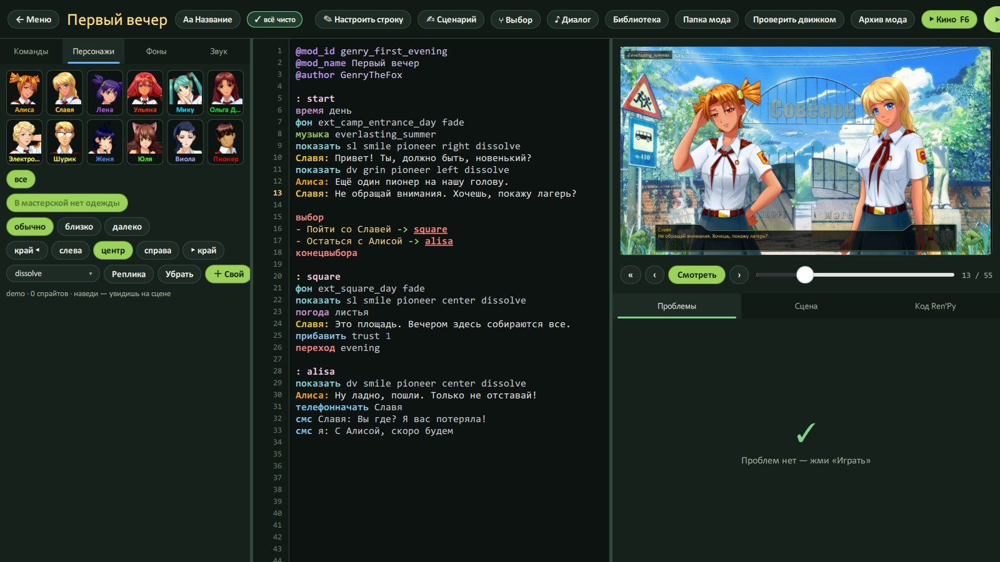

# Персонажи и гардероб

[← Вики](README.md)

Весь лагерь в твоём распоряжении: кого вывести, с какой мордой, в чём и куда поставить.

## Как показать героя

```
показать dv smile pioneer left dissolve
```

По порядку: **кто** (`dv` — Алиса), **эмоция** (`smile`), **одежда** (`pioneer`), **где** (`left`),
**как появиться** (`dissolve`). Где и как — можно не писать.

Проще всего не печатать, а щёлкать: вкладка **«Персонажи»** → щёлкни героиню → внизу плитки всех её эмоций.
Наведи мышь на плитку — героиня уже стоит в кадре справа. Щёлкни — строка вставилась.



Над плитками — переключатели: **одежда** (pioneer, sport, swim, dress…), **обычно / близко / далеко**,
**позиция** (край ◂, слева, центр, справа, ▸ край), переход. Кнопки **«Реплика»** — вставить сразу `Имя: `,
**«Убрать»** — увести героиню, **«＋ Свой»** — свой PNG-персонаж.

## Кто есть кто

| Код | Кто |
|---|---|
| `dv` | Алиса |
| `sl` | Славя |
| `un` | Лена |
| `us` | Ульяна |
| `mi` | Мику |
| `mt` | Ольга Дмитриевна |
| `mz` | Женя |
| `uv` | Юля |
| `cs` | Виола |
| `el` | Электроник |
| `sh` | Шурик |
| `pi` | Пионер |

В репликах пиши просто имя: `Алиса: …`, `Славя: …`. Свой говорящий — `персонаж vs Вожатая #ff8800`, дальше `Вожатая: …`.

## Позиции и расстояние

- `left`, `center`, `right` — слева, по центру, справа; `fleft`, `fright` — у самого края.
- `close` в имени — крупно: `показать un shy pioneer close center`; `far` — издалека.
- `крупно …`, `полныйрост …`, `зеркало …` — крупный план, во весь рост, отзеркалить.
- `входслева …` / `идти …` / `выходсправа …` — зайти, пройтись, уйти за край.
- `фокус А | Б` — спор двоих: кто говорит — ярче и ближе. `массовка …` — толпа до 10 человек, расставятся сами.

## Румянец, пот, слёзы, мокрая

Допиши после одежды — и они лягут ровно на щёки, лоб или волосы этой позы:

```
показать dv smile pioneer румянец пот left
показать un sad pioneer слёзы center
```

## Гардероб Мастерской

Подписался в Steam на моды с одеждой (пак ресурсов для модостроителей, 7ДЛ, БКРР и прочие) — GenryBL сам находит
в них наряды и лица и надевает их на героинь игры. В «Персонажах» под обычной одеждой появится кнопка
**«Гардероб мастерской»** — там всё, что нашлось у тебя.

```
показать dv smile casual left
```

— это Алиса в `casual` из пака, на родном теле игры, с родной улыбкой. В моде она будет работать у всех игроков:
нужные картинки GenryBL сам кладёт внутрь мода, подписываться им ничего не надо.

Что ещё полезно знать:

- **18+ наряды** (бельё, полотенца, голые) — только для взрослых героинь и прячутся за переключателем «18+».
  **Ульяна — только в одежде и только на своём родном теле.** Никаких исключений.
- **✕ на плитке** — удалить кривой спрайт навсегда. Передумал — «Удалённые» → вернуть.
- **✎ на плитке** — лицо съехало? Подвинь его руками, и для одного спрайта, и для всего наряда сразу.
- **Цельные картинки** (например, Лена «boy» — целая спортивная Лена) носятся одни, без тела и без эмоции:
  `показать un boy`.
- Мастерская подхватывается при запуске. Подписался на новое — перезапусти GenryBL.
