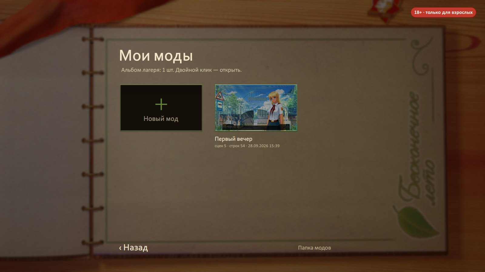
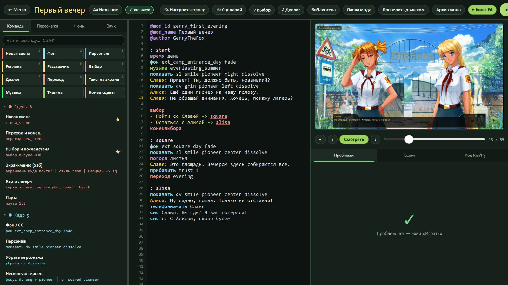
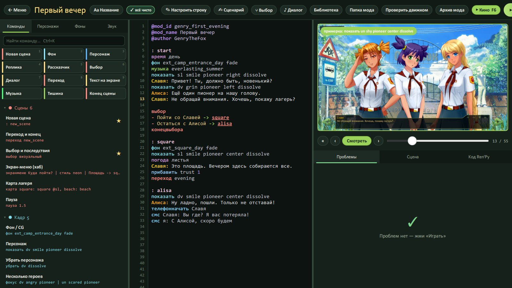
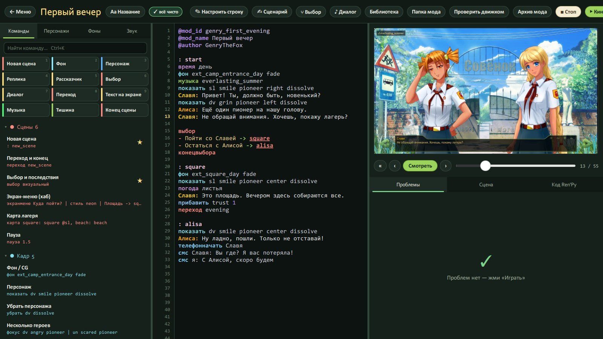

# Первый мод за 10 минут

[← Вики](README.md)

Сейчас ты сделаешь мод. Настоящий, который открывается в игре. Без Ren'Py, без консоли и без седых волос.
Засекай время.

## 1. Создай мод

Главное меню → плакат **«Начать игру» → «Новый мод»** → придумай название → **«Создать»**.

Откроется редактор, а в нём уже лежит маленькая история-пример: Славя встречает новенького у ворот, выбор
«пойти со Славей / остаться с Алисой», вечер с Леной. Её можно сразу запустить, посмотреть и переделать под себя.

Все твои моды потом лежат в **«Сохранение» → «Мои моды»**.



## 2. Что где в редакторе



- **Посередине — текст истории.** Одна строка — одно действие: показать фон, вывести героя, сказать реплику.
- **Слева — вкладки:** «Команды» (все команды кнопками), «Персонажи» (герои, эмоции, одежда), «Фоны» (фоны и CG),
  «Звук» (музыка, звуки, атмосфера). Щёлкнул — строка вставилась туда, где стоит курсор.
- **Справа — кадр.** Щёлкни по любой строке — справа будет ровно то, что увидит игрок в этот момент.
  Наведи мышь на эмоцию или фон в списке слева — кадр сразу примерит его, ещё до вставки.
- **Под кадром — «Проблемы».** Опечатка в эмоции, несуществующий фон, потерянная сцена — всё видно тут до запуска.
- **Сверху — кнопки:** «Играть» (F5), «Кино» (F6), «Выбор», «Диалог», «Сценарий», «Библиотека», «Проверить движком»,
  «Архив мода», «Папка мода».

Текст сохраняется сам, через секунду после каждой правки (и по Ctrl+S).



## 3. Как пишется история

```
@mod_id genry_first_evening
@mod_name Первый вечер
@author GenryTheFox

: start
время день
фон ext_camp_entrance_day fade
музыка everlasting_summer
показать sl smile pioneer right dissolve
Славя: Привет! Ты, должно быть, новенький?
показать dv grin pioneer left dissolve
Алиса: Ещё один пионер на нашу голову.

выбор
- Пойти со Славей -> square
- Остаться с Алисой -> alisa
конецвыбора

: square
фон ext_square_day fade
Славя: Это площадь. Вечером здесь собираются все.
конецигры
```

Что тут что:

- **Три строки сверху** — паспорт мода: код (латиницей, по нему игра отличает мод), название и автор.
  Поменять название удобно кнопкой **«Aa Название»**.
- **`: start`** — начало сцены. Мод всегда начинается со сцены `start`. Сцен может быть сколько угодно, названия — хоть
  по-русски.
- **`фон …`, `показать …`, `музыка …`** — команды. Их не надо помнить: они все есть во вкладке «Команды», а при наборе
  программа сама подсказывает продолжение — персонажей, эмоции, одежду, позиции.
- **`Славя: Привет!`** — реплика. Имя, двоеточие, текст. Для рассказчика — `текст Солнце жарило нещадно.`
- **`выбор … конецвыбора`** — развилка: вариант → в какую сцену ведёт.
- **`конецигры`** — финал мода.

Полный список команд — в [шпаргалке](commands.md).

## 4. Запусти в игре

Поставь курсор на строку, с которой хочешь смотреть, и жми **«Играть» (F5)**. GenryBL:

1. соберёт мод и положит его в игру (`game\mods\<код мода>`);
2. откроет «Бесконечное лето» окном — сразу в этой сцене;
3. даст игре отдельные сохранения, так что твои обычные сейвы не тронутся.



Не хочешь ждать игру — жми **«Кино» (F6)**: мод проиграется прямо в конструкторе, с печатью текста, музыкой и
выборами. Подробнее — в [кино-режиме](cinema-check.md).

## 5. Дальше

- Добавь героиням [одежду и эмоции](characters.md), включи [погоду и эффекты](phone-map-weather.md).
- Сделай [ветки и концовки](choices.md).
- Готово — [выкладывай](publish.md).
