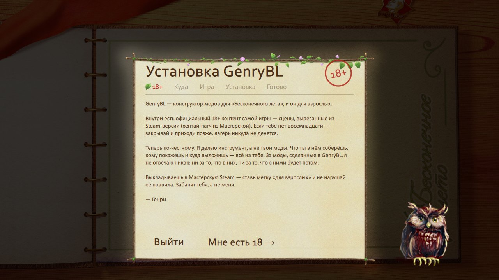
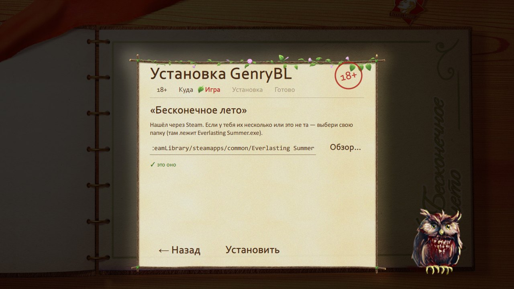

# Установка

[← Вики](README.md)

Ставится проще, чем Ульяна ворует конфеты. Две минуты — и ты в лагере.

## Что нужно

- Windows 10 или 11.
- «Бесконечное лето» из Steam. Оно бесплатное — просто поставь его, если ещё нет.

Больше ничего. Всё остальное (Qt, Visual C++, ffmpeg для звука и видео, 18+ патч) уже внутри GenryBL и работает
даже на свежей чистой Windows.

## Скачать

Страница релизов: **[github.com/GenryTheFox0/GenryBL/releases](https://github.com/GenryTheFox0/GenryBL/releases/latest)**

- **GenryBL_Setup.exe** — установщик. Советую его.
- **GenryBL_V1_portable.zip** — без установки: распаковал куда угодно и запустил `GenryBL\app\GenryBL.exe`.

## Или через Мастерскую Steam

1. Подпишись на [GenryBL в Мастерской](https://steamcommunity.com/sharedfiles/filedetails/?id=3809725763).
2. Запусти «Бесконечное лето» → «Моды» → **«GenryBL — конструктор модов»**.
3. Лагерь коротко покажет, что умеет конструктор, а в конце жми **«Установить GenryBL сейчас»** — откроется тот же
   установщик.

Программа всё равно ставится к тебе на компьютер, а не живёт в Мастерской: твои моды хранятся в её папке, и
обновления или отписка их не тронут. Для 18+ в этой версии подпишись на официальный патч
[«Deleted hentai scenes»](https://steamcommunity.com/sharedfiles/filedetails/?id=1118110148) — GenryBL подхватит его сам.

## Если Windows пугает

Программа бесплатная и без платной цифровой подписи, поэтому Windows может показать синее окно
«Windows защитила ваш компьютер». Жми **«Подробнее» → «Выполнить в любом случае»**.

Некоторые антивирусы ругаются на любые новые программы без подписи. Если твой удалил файл — верни его из карантина
и добавь папку GenryBL в исключения. Код открыт, можешь сам посмотреть, что внутри.

## Установка по шагам

1. Запусти **GenryBL_Setup.exe**. Он распакуется и откроет установщик в стиле самой игры.
2. Подтверди, что тебе есть 18.

   

3. **Куда поставить.** По умолчанию — в твою папку программ, админ не нужен. Можно выбрать любую другую.
   Тут же галочки «ярлык на рабочем столе» и «в меню Пуск».
4. **Игра.** Установщик сам находит «Бесконечное лето» через Steam. Если у тебя несколько библиотек Steam или игра
   лежит где-то ещё — жми «Обзор…» и выбери папку, где лежит `Everlasting Summer.exe`.

   

5. **Установить** — и через полминуты готово.

   

Туда, где лежит сама игра или исходники GenryBL, установщик ставить не даст — чтобы ничего не перетереть.

## Первый запуск

Откроется главное меню — доска «Информация» в лагере. Наведи мышь на плакаты:

- **Начать игру → Новый мод** — начать новую историю;
- **Сохранение → Мои моды** — открыть, запустить, поделиться;
- **Галерея** — все персонажи, фоны и CG игры;
- **Табуретка с кистями → Инструменты** — настройки: музыка, громкость, другая папка игры;
- **Калитка «Выход»** — выйти;
- **Информация** (надпись сверху) — коротко, как всё устроено.

## Обновить

С V1.0.2 перекачивать руками не надо. В главном меню, на записке «Поддержать GenryBL», внизу строка
**«Обновления»**: программа сама проверяет их при запуске, и если вышла новая версия — кнопка становится зелёной,
**«Обновить до V…»**. Жмёшь — GenryBL скачает её, закроется, поставит поверх и откроется уже новым. Твои моды
(папка `projects`) и настройки не трогаются.

- **Ставил из Мастерской Steam** — Steam сам скачивает новую версию предмета, GenryBL берёт установщик оттуда,
  без интернета и без GitHub.
- **Ставил с GitHub** — качается `GenryBL_Setup.exe` последнего релиза и сверяется с его контрольной суммой.
- Без кнопок: `GenryBL.exe --update-now` — проверит и обновит сам.
- По-старому тоже можно: скачай новый **GenryBL_Setup.exe** и поставь поверх, в ту же папку.

Версии до V1.0.2 кнопки не знают — их один раз обнови руками.

## Удалить

- Ставил установщиком — **Параметры Windows → Приложения → GenryBL → Удалить**. Твои моды останутся, если сам не
  поставишь галочку «удалить и мои моды».
- Portable — просто удали папку. Моды лежат в ней, в `projects`, — забери их заранее, если нужны.

## Где что лежит

| Папка | Что там |
|---|---|
| `app` | сама программа |
| `data` | данные конструктора: каталог игры, шаблоны, ffmpeg, 18+ патч |
| `projects` | твои моды — по папке на мод |
| `work` | настройки и кэш |

Собранные моды GenryBL кладёт туда, где их ищет сама игра: `Everlasting Summer\game\mods\<id мода>`.
