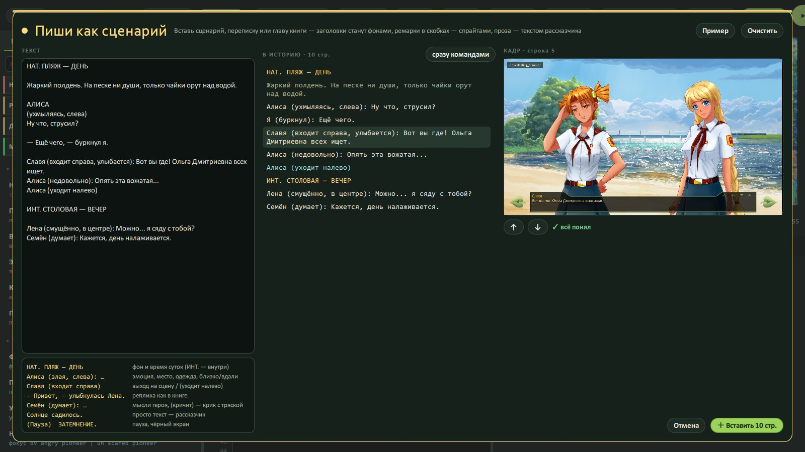
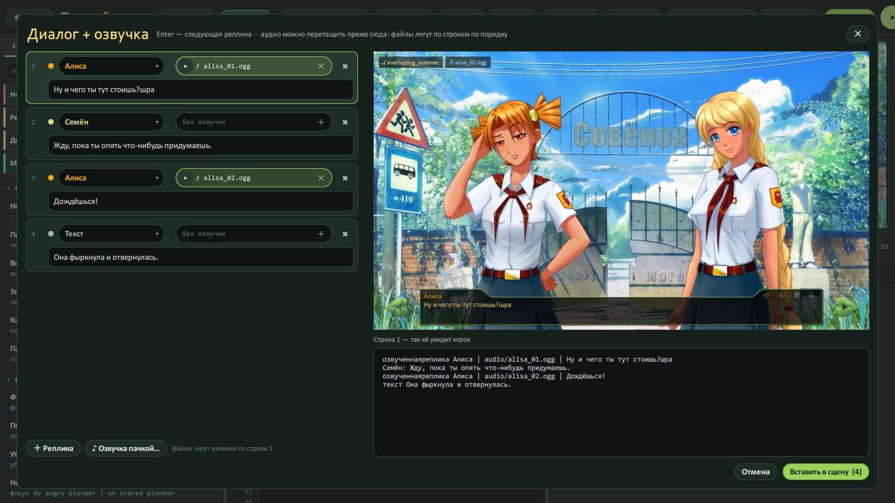

# Пиши как сценарий

[← Вики](README.md)

Есть фанфик? Сценарий? Переписка в чате? Не перепечатывай — вставь.

## Как

Кнопка **«Сценарий»** сверху (или скопируй текст и нажми **Ctrl+Shift+V**) → вставь текст → смотри справа, во что
он превратится → «Вставить».



## Что понимает

```
НАТ. ПЛЯЖ — ДЕНЬ

Жаркий полдень. На песке никого.

АЛИСА
(ухмыляясь)
Ну что, струсил?

Алиса (злая, слева): Ну и чего ты встал?
— Иду, — буркнул я.
Алиса (уходит направо)
```

- **«НАТ. ПЛЯЖ — ДЕНЬ»** — станет фоном пляжа днём.
- **«Алиса (злая, слева): …»** — Алиса со злой мордой слева и её реплика.
- **Имя заглавными и ремарка в скобках** — как в киносценарии.
- **Проза** — слова рассказчика.
- **«— Иду, — буркнул я.»** — реплика героя, как в книге.
- **«Алиса (уходит направо)»** — Алиса уходит за правый край.

Любую строку-сценарий можно развернуть в обычные команды: **Ctrl+Shift+E** — и увидишь, что она значит на самом деле.

## Диалог таблицей

Кнопка **«Диалог»** (Ctrl+D) — реплики таблицей: кто, эмоция, текст, файл озвучки. Удобно, когда надо много
болтовни и её озвучку по порядку.


